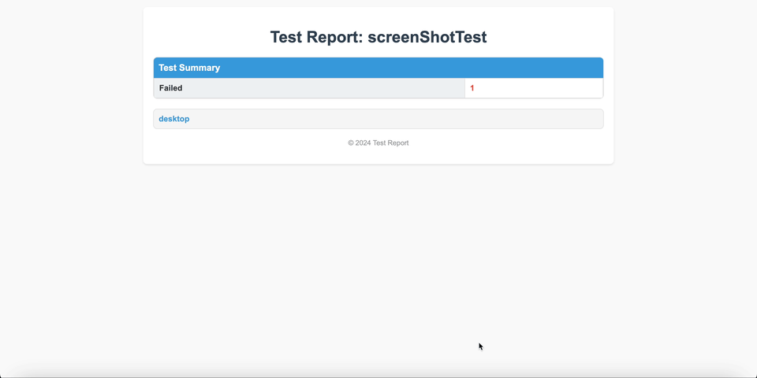

# [Screenshot Testing](https://kmp.telereso.io/docs/core-ui-test/0.6.1/-core/io.telereso.kmp.core.ui.test/run-screen-shot-test.html){:target="_blank"}

Screenshot testing ensures your components, widgets, and pages maintain consistent visuals. It helps track changes in fonts, colors, or sizes across your composable functions, acting as a visual regression tool.



## Usage

### Adding Dependencies

Include the `core-ui-test` library in your `commonTest` source set:

```kotlin
val coreVersion = "<latest-version>"
val commonTest by getting {
    dependencies {
        implementation("io.telereso.kmp:core-ui-test:$coreVersion")
    }
}
```

### Enabling Screenshot Testing
Configure your module to support screenshot testing by enabling the required features in your Gradle setup:

```kotlin
plugins {
    id("com.android.library")
    id("org.jetbrains.kotlin.multiplatform")
    id("io.telereso.kmp")
}

teleresoKmp {
    // Enable storing screenshots
    enableScreenShots = true
    
    // Set tolerance for screenshot verification (1f = 0.1%)
    screenShotsTolerance = 1f
}
```

## Writing a Test
Wrap your composable code inside runScreenShotTest to capture and verify screenshots.

```kotlin
@Test
fun testButton() = runScreenShotTest(
    devices = listOf(Devices.Pixel_3), // Set Devices to run tests on
    wait = 1.toDuration(DurationUnit.SECONDS) // Will wait for animations to finish before taking screenshot
) {
    var text by remember { mutableStateOf("Hello") }
    Text(
        text = text,
        modifier = Modifier.testTag("text")
    )
    Button(
        onClick = { text = "Compose" },
        modifier = Modifier.testTag("button")
    ) {
        Text("Click me")
    }
}
```

you can pass options to `runScreenShotTest` to control the devices with screen sizes (each device will have a screenshot)

Also can add a wait (delay) if your UI need to finish running some animation before taking the screenshot

## Recording Screenshots
Run the test manually for the first time to generate and save screenshots under:
`<module>/telereso/screenShots`

Alternatively, use the `recordTeleresoScreenShots` Gradle task:

```shell
./gradlew recordTeleresoScreenShots
```

This task cleans the `<module>/telereso/screenShots` directory, runs all tests in `commonTest`, and records new screenshots.

## Verifying Changes
When re-running tests, the system compares new screenshots with the base ones. If any changes are detected:

The test fails.
A detailed report is generated at:
`<module>/build/telereso/reports`


## Report Details
The generated report highlights differences with the following sections:

### Difference Image
Highlights changes between the base image and the new screenshot.

### Compare Image
Provides an onion-skin overlay to compare the base and new screenshots visually.

## CI Integration
Screenshot testing runs exclusively on the desktop platform (JVM). 

No additional changes are required for your current CI pipelines.

## Platform Support

* Desktop (jvm): tests and screenshots will be performed on this target
* Web: Optional support for Kotlin/Wasm is planned for future releases.
* Android/iOS: Tests on these targets will be empty (always pass), to avoid the need of providing emulators/simulators and potential flakiness in CI.
