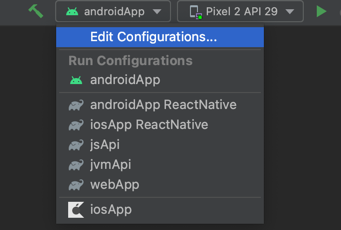

{: .no_toc }

<details open markdown="block">
  <summary>
    Table of contents
  </summary>
  {: .text-delta }
- TOC
{:toc}
</details>

---

All the samples can be ran from the configurations dropdown menu



Before running the samples make sure to run the following in the root directory 

```shell
./gradlew initAll
```

---

## Android App

The `Android App` module is a sample Android project that demonstrates how to import the client library and provides usage samples for calling APIs and listening to reactive flows.

---

## iOS App

The `iOS App` module is a sample iOS project that demonstrates how to import the client library and provides usage samples for calling APIs and listening to reactive flows.

Before running the sample, ensure that you run `./gradlew initAll` in the root project.

---

## Web App

The `Web App` module is a sample React project that demonstrates how to import the client library and provides usage samples for calling APIs and listening to reactive flows.

Before running the sample, ensure that you run `./gradlew initAll` in the root project.

---

## Jvm Api

The `Jvm Api` module is a sample Java [Spring Boot](https://spring.io/){:target="_blank"} project that demonstrates how to import the `Models` library.

---

## Js Api

The `Js Api` module is a sample NodeJs [Express](https://expressjs.com/){:target="_blank"} project that demonstrates how to import the `Models` library.

---

## ReactNative

The `ReactNative` module provides support for bridging Kotlin Multiplatform code into native libraries for both Android and iOS platforms. You can learn how to enable this feature [here]()

The module contains a folder for React Native, which includes the React Native library, as well as examples for both Android and iOS platforms.

---

## Flutter 🏗️

_Will be available by end of this year (2023)_

---

# Issues

If you encounter any issues while working with the project, you can report them by creating an issue [in the project repository here](https://github.com/telereso/kmp-core)